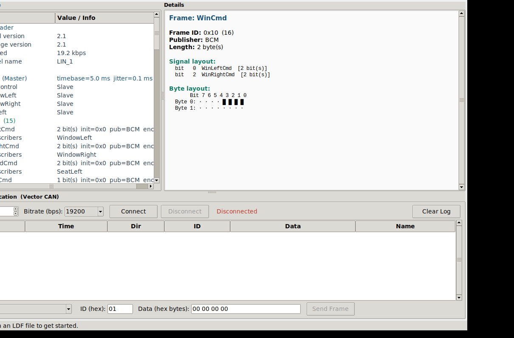

# Easy-LIN

Easy-LIN is a Python tool for working with the **LIN (Local Interconnect Network)** bus protocol. It combines LDF parsing, consistency checks, and real-time/simulated communication workflows in a desktop application.

## Overview

Easy-LIN lets you:

- Parse and interpret LIN Description Files (`.ldf`) for network topology, signals, frames, schedules, and node attributes
- Validate LDF internal consistency (signal sizes, frame payloads, schedule tables, node definitions)
- Browse LDF content in a GUI tree and inspect detailed signal/frame metadata
- Communicate with real LIN hardware (Vector XL driver via `python-can`) for frame TX/RX
- Fall back to simulation mode when hardware is unavailable



## Features

- LDF parser supporting common LIN spec sections and metadata
- LDF consistency checking to catch invalid definitions early
- Live communication panel for connect/send/monitor workflows
- Interactive project layout designed for extension to other USB LIN interfaces

## Project Structure

```text
Easy-LIN/
|- main.py                        Application entry point
|- requirements.txt               Python dependencies
|- src/
|  |- ldf/
|  |  |- parser.py                LDF parser
|  |- communication/
|  |  |- vector_lin.py            Vector CAN/LIN wrapper
|  |- gui/
|  |  |- main_window.py           Main window
|  |  |- ldf_tree.py              LDF tree widget
|  |  |- signal_viewer.py         Signal/details panel
|  |  |- comm_panel.py            Communication panel
|- tests/
|  |- test_ldf_parser.py          Parser tests
|  |- fixtures/
|  |  |- sample.ldf               Test fixture
```

## Quick Start

1. Install dependencies:

```bash
pip install -r requirements.txt
```

2. Run the application:

```bash
python main.py
```

3. Open an LDF file from the GUI.

## LIN Communication Requirements

- Vector LIN-compatible interface
- Vector XL driver installed
- `python-can >= 4.0.0`

## Running Tests

```bash
python -m pytest tests/ -v
```

## License

This project is source-available. See the [LICENSE](LICENSE) file for full terms.

In short: personal, non-commercial use is allowed; redistribution and commercial usage require prior written permission from the author.

## Contributing

Contributions, bug reports, and feature requests are welcome via issues and pull requests on GitHub.

